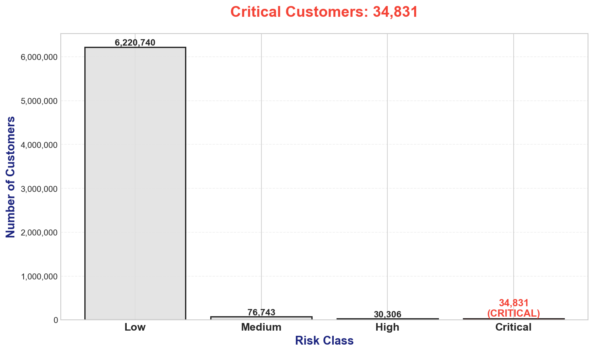
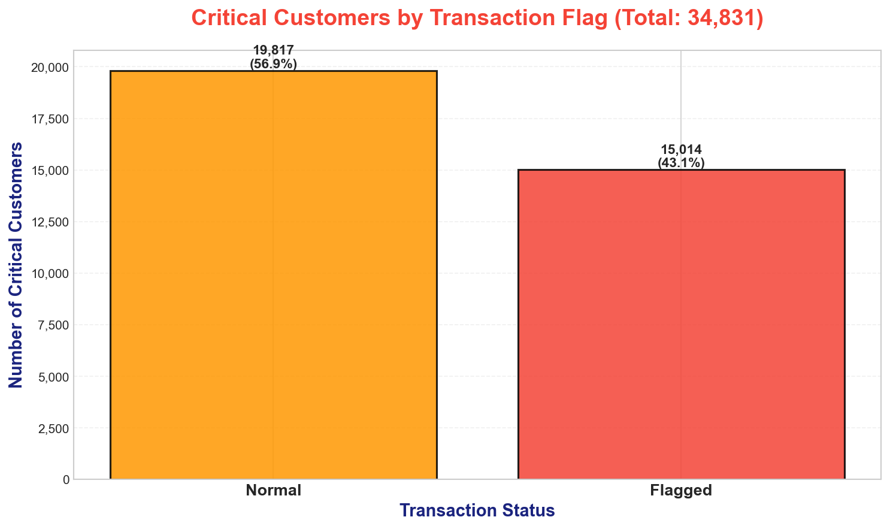
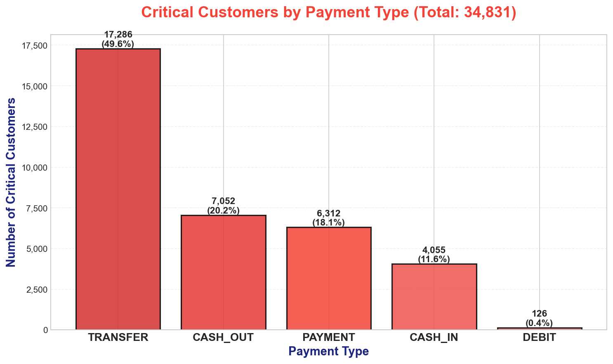

```text
🔍💳 FRAUDLENS 💳🔍

 ______   _____               _    _   _____    _        ______   _   _    _____ 
|  ____| |  __ \      /\     | |  | | |  __ \  | |      |  ____| | \ | |  / ____|
| |__    | |__) |    /  \    | |  | | | |  | | | |      | |__    |  \| | | (___  
|  __|   |  _  /    / /\ \   | |  | | | |  | | | |      |  __|   | . ` |  \___ \ 
| |      | | \ \   / ____ \  | |__| | | |__| | | |____  | |____  | |\  |  ____) |
|_|      |_|  \_\ /_/    \_\  \____/  |_____/  |______| |______| |_| \_| |____/


📊 Statistical Analysis Risk Scoring & Anomaly Detection
🧠 Banking Transactions Intelligence System

© Ahmed Sharaf – ITI-AI
```


**FRAUDLENS** is a lightweight Python toolkit and console app for cleaning transaction data, building features, scoring customer risk, flagging suspicious transactions, and exporting reports and a dashboard.

---

## Table of Contents

- [Features](#features)
- [Prerequisites](#prerequisites)
- [Installation](#installation)
- [Quick Start](#quick-start)
- [Start script (Unix)](#start-script-unix)
- [Usage & Commands](#usage--commands)
- [Project Structure](#project-structure)
- [Data Format](#data-format)
- [How the Scoring & Flagging Works](#how-the-scoring--flagging-works)
- [Outputs & Interpretation](#outputs--interpretation)
- [Configuration](#configuration)
- [Contributing](#contributing)
- [Utilities](#utilities)
- [Troubleshooting](#troubleshooting)
- [License & Contact](#license--contact)

---

## 🚀 Features

- Data cleaning and validation for raw transaction CSVs
- Customer-level feature construction (velocity, frequency, averages)
- Rule-based, Z-score driven transaction flagging
- Customer risk scoring and bucketing
- Exportable CSV reports, text summary, and dashboard charts

---

## ✅ Prerequisites

- Python 3.10+ recommended ( create your own env)
- `pip` and a virtual environment tool (venv)
- Required Python packages in `requirements.txt`

---

## ⚙️ Installation

Windows (PowerShell example):

```powershell
# create and activate a venv
python -m venv .venv
.\.venv\Scripts\Activate.ps1
# install dependencies
pip install -r requirements.txt
```

---

## 🎯 Quick Start

1. Activate your virtual environment (see Installation above) or use the included `start.sh` (Unix-like systems).
2. Place your transaction CSV in `dataset/` (or update `data_manager` to read from another folder).
3. Run the console app to use the interactive menu:

```bash
# Unix
./start.sh

# Or (any OS with env active):
python main.py
```

The console UI guides you through cleaning, feature building, scoring, flagging, and exporting reports.

---

## Usage & Commands

- Run the main console UI: `python main.py`
- Run the console app module directly: `python -m app.console_app`
- Use the exposed classes and static methods when scripting or in notebooks. Example pipeline that matches the current codebase:

```python
from data_manipulator.data_manager import DataManager
from data_manipulator.transactions_cleaner import TransactionCleaner
from features_builder.customer_features_builder import CustomerFeaturesBuilder
from features_builder.transaction_features_builder import TransactionFeaturesBuilder
from calculations.risk_score import CustomerRiskScorer
from calculations.transaction_flager import TransactionFlagger
from report_generator.report_generator import ReportGenerator

# Load CSV files from the `dataset/` directory
res = DataManager.read_csv('dataset')
df = res['data_frame']

# Clean
cleaned = TransactionCleaner.clean(df)['cleaned_data']

# Build customer and transaction features
cust_features = CustomerFeaturesBuilder.build(cleaned)
full_features = TransactionFeaturesBuilder.build(cust_features)

# Scoring and flagging
scored = CustomerRiskScorer.build(full_features)
flagged = TransactionFlagger.build(scored)

# Export reports
rg = ReportGenerator(flagged)
rg.export_all()
```

---

## 📁 Project Structure

- `main.py` — console entry point
- `start.sh` — convenience script to create env, install deps, and run `main.py` (Unix)
- `app/` — console app package
  - `console_app.py` — user-facing menu and orchestration
- `utils.py` — console helpers and banner utilities
- `data_manipulator/` — CSV loading & cleaning
  - `data_manager.py`
  - `transactions_cleaner.py`
- `features_builder/` — builders for features
  - `customer_features_builder.py`
  - `transaction_features_builder.py`
- `calculations/` — scoring & flagging logic
  - `risk_score.py`
  - `transaction_flager.py`
- `report_generator/` — exports and dashboard generation
  - `report_generator.py`
  - `dashboard_generator.py`
- `constants/` — configuration and constants
  - `config.py`, `keys.py`, `colors.py`
- `dataset/` — sample datasets and readme
- `requirements.txt` — pinned dependencies

---

## 🧰 Utilities

- `utils.py` — small console helpers used by the CLI (banner display, clearing screen, centered printing, wait & error prompts)

**Key functions:**

- `show_banner()` — display the application banner centered in the terminal.
- `clear_screen()` — clear the console (Windows `cls`).
- `print_centered(text)` — print multi-line text centered to the terminal width.
- `wait()` — pause until the user presses Enter.
- `error(msg)` — show the banner and display an error message, then pause for acknowledgement.

**Example:**

```python
from utils import show_banner, error

show_banner()
error("Unable to load data.csv")
```

> Tip: `utils.py` is used by the console UI for consistent banners and user prompts.

---

## 📊 Data Format

The sample data `paysim.csv` is expected to contain at least the following columns (common to synthetic transaction datasets):

- `step`, `type`, `amount`, `nameOrig`, `oldbalanceOrg`, `newbalanceOrig`, `nameDest`, `oldbalanceDest`, `newbalanceDest`, etc.

Notes:

- Amounts should be numeric; missing balances are handled with an epsilon defined in `constants/config.py`.
- If your dataset uses different column names, adapt `data_manager` or add a small adapter script.

---

## How the Scoring & Flagging Works

See full algorithmic explanations in `calculations/risk_score.py` and `calculations/transaction_flager.py`.

- Customer risk uses aggregated features (daily velocity, weekly counts, average amounts), transformed into Z-scores and averaged into a single `risk_score` that maps to `risk_class` buckets (`low`, `medium`, `high`, `critical`).
- Transaction flagging computes per-transaction feature Z-scores (e.g., amount relative to sender weekly average) and flags transactions that exceed a configurable Z-score threshold (default **3.0**).

These rules are tunable if you have labeled data or want to use a different strategy (ML model, isolation forest, etc.).

---

## 📥 Outputs & Interpretation

- `outputs/flagged_transactions.csv` — flagged transactions with per-feature Z-scores and a `transaction_flag` column
- `outputs/customer_risk_summary.csv` — one row per customer with `risk_score` and `risk_class`
- `outputs/report.txt` — a short human-readable summary with counts and top anomalies
- `outputs/charts/` — visuals used by the dashboard

---

## 📊 Dashboard & Quick Summary

You can quickly produce a printable PDF dashboard that summarizes critical customers and the most important charts. Sample charts (also included in the `asset/` folder) are shown below:

- 
  **Critical by Risk Class** — distribution of customers across risk buckets.

- 
  **Critical by Transaction Flag** — shows normal vs flagged counts among critical customers.

- 
  **Critical by Payment Type** — breakdown of critical customers by payment type.

### Generating the Dashboard PDF

- From the console UI: choose **Export Dashboard** (requires scoring & flagging to be run first).
- Programmatically:

```python
from report_generator.dashboard_generator import DashboardGenerator
# pass the DataFrame after scoring & flagging
dg = DashboardGenerator(scored_df)
pdf_path = dg.export_dashboard_pdf()
print(pdf_path)  # -> outputs/Dashboard.pdf
```

> **Note:** The PDF is saved as `outputs/Dashboard.pdf` and the charts are also saved to `outputs/charts/`. Use the PDF for fast summaries or stakeholder presentations.


Interpretation tips:

- Use `risk_class` to prioritize investigations (e.g., `critical` first).
- Review the top contributing feature Z-scores to understand why a customer/transaction was flagged.

---

## 🔧 Configuration

Configuration values live in `constants/config.py`. Key configuration points:

- `E` — small epsilon value used to avoid division by zero in ratio calculations (default `1e-6`).
- Transaction flag threshold is implemented as a parameter to `TransactionFlagger.compute_flags(..., threshold=3.0)` (default `3.0`) and is not yet centralized in `constants/config.py`.

To adjust behavior for production, you can either modify `TransactionFlagger` defaults, add a `FLAG_ZSCORE_THRESHOLD` constant to `constants/config.py`, or wrap configuration with environment variable support.

---

## 🤝 Contributing

- Fork the repo and open a PR with clear changes and tests when possible.
- Follow consistent formatting (PEP8) and add test coverage for new features.
- Update `README.md` when adding public-facing functionality or API changes.

---

## ❗ Troubleshooting

- If CSV fails to load:
  - Check encoding (UTF-8 recommended) and delimiter.
- If dependencies fail:
  - Recreate the venv and `pip install -r requirements.txt`.
- If you see unexpected NaNs in features:
  - Check for missing or zero balances and inspect `EPSILON` handling.

---

## 📜 License & Contact

This project is for educational/demo purposes. Contact: Ahmed Sharaf — ITI AI Track

---

If you'd like, I can also:

- Add unit tests and CI for this repo ✅
- Add an example notebook that runs the full pipeline end-to-end ✅

Happy analyzing! 🚀
